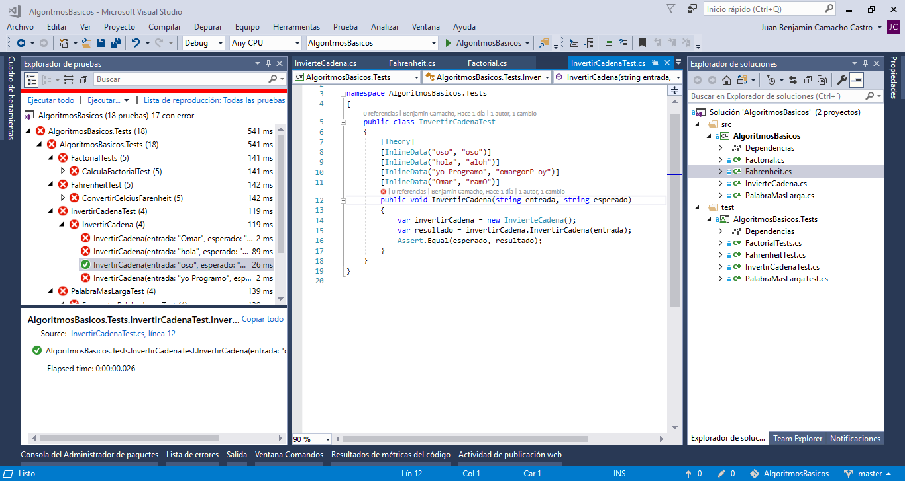

# Algoritmos Básicos

Algoritmos Básicos con C#

El repositorio contien un conjunto de ejercicios básicos de programación junto con sus pruebas unitirias. Se requiere el [.NET Core SDK 2.2](https://dotnet.microsoft.com/download)

Para iniciar clona el repositorio.

```sh
git clone https://github.com/jahbenjah/AlgoritmosBasicos.git
```
Edta el archivo deseaso y ejecuta el comando 

```sh
dotnet test
```

La serie comleta estara publicada en https://aspnetcoremaster.com/ si tienes alguna duda. Deja un comentario.

Si usas Visual Studio 2017 ejecuta las pruebsas desde ``Pruebas > Ventanas > Explorador de Pruebas``


